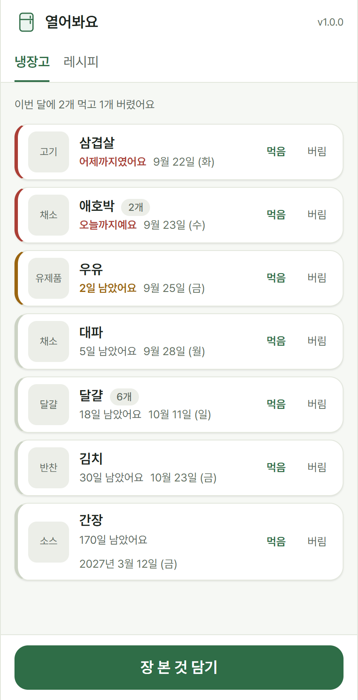

<a id="readme-top"></a>

[![Contributors][contributors-shield]][contributors-url]
[![Forks][forks-shield]][forks-url]
[![Stargazers][stars-shield]][stars-url]
[![Issues][issues-shield]][issues-url]
[![MIT License][license-shield]][license-url]

<br />
<div align="center">
  <a href="https://github.com/dev1f965x/yeoreobwayo">
    
  </a>

  <h3 align="center">열어봐요</h3>

  <p align="center">
    The fridge, filled in as the shopping bag is unpacked — what is in it, how much, and what has to be eaten first.
    <br />
    <a href="https://dev1f965x.github.io/yeoreobwayo/">Open it »</a>
    ·
    <a href="docs/product.md">Explore the docs</a>
    ·
    <a href="https://github.com/dev1f965x/yeoreobwayo/releases">Download</a>
    ·
    <a href="https://github.com/dev1f965x/yeoreobwayo/issues/new?labels=bug">Report Bug</a>
    ·
    <a href="https://github.com/dev1f965x/yeoreobwayo/issues/new?labels=feature">Request Feature</a>
  </p>
</div>

<details>
  <summary>Table of Contents</summary>
  <ol>
    <li>
      <a href="#about-the-project">About The Project</a>
      <ul>
        <li><a href="#built-with">Built With</a></li>
      </ul>
    </li>
    <li>
      <a href="#getting-started">Getting Started</a>
      <ul>
        <li><a href="#prerequisites">Prerequisites</a></li>
        <li><a href="#installation">Installation</a></li>
      </ul>
    </li>
    <li><a href="#usage">Usage</a></li>
    <li><a href="#roadmap">Roadmap</a></li>
    <li><a href="#license">License</a></li>
    <li><a href="#contact">Contact</a></li>
    <li><a href="#acknowledgments">Acknowledgments</a></li>
  </ol>
</details>

## About The Project

<div align="center">
  
</div>

Every fridge app fails at the same place: **putting things in**. Nobody opens an app after
the shopping to type fourteen lines, so the list goes stale in a week and the milk goes off
behind it anyway.

열어봐요 is built around the two minutes after the shopping.

- **Unpacking** is one screen: take a thing out of the bag, type its name, tap. The expiry
  is guessed from what kind of thing it is, the count starts at one, and a photo is
  optional. A name typed once comes back the next time it is bought, with the length that
  was actually given it.
- **The fridge** is sorted by what has to go first, with what is past and what is close
  marked plainly. One tap takes one away when it is eaten; throwing something out is a
  separate tap, and is counted as waste rather than as a meal.
- **Recipes** are sorted by how much of each is already in the fridge — what can be cooked
  right now, then what one more thing would make — and a dish that uses up something about
  to go is lifted among equals.
- Everything stays on the device. No account, no sync, no analytics; the photos never leave
  the browser they were taken in.

<p align="right">(<a href="#readme-top">back to top</a>)</p>

### Built With

[](https://tauri.app/)
[](https://www.rust-lang.org/)
[](https://react.dev/)
[](https://www.typescriptlang.org/)
[](https://vite.dev/)
[](https://playwright.dev/)
[](https://vitest.dev/)
[](https://biomejs.dev/)
[](https://docs.github.com/actions)

<p align="right">(<a href="#readme-top">back to top</a>)</p>

## Getting Started

### Prerequisites

Nothing, to use it in a browser.

To build it: [Node.js](https://nodejs.org) 24, [Rust](https://rustup.rs) stable, and the
[Tauri prerequisites](https://tauri.app/start/prerequisites/) — plus the Android SDK and
NDK for the APK.

### Installation

- **Web** — <https://dev1f965x.github.io/yeoreobwayo/>. Nothing to install, and it keeps
  working offline once loaded.
- **Android** — the `.apk` from the
  [latest release](https://github.com/dev1f965x/yeoreobwayo/releases/latest). Android asks
  once for permission to install an app from outside the Play Store.

The two are separate fridges: what goes in on the phone stays on the phone (ADR 4).

From source:

```sh
git clone https://github.com/dev1f965x/yeoreobwayo.git
cd yeoreobwayo
npm install
npm run dev                # the page
npm run tauri android dev  # the app, on a phone or an emulator
```

<p align="right">(<a href="#readme-top">back to top</a>)</p>

## Usage

1. Back from the shops, tap **장 본 것 담기** and unpack the bag one thing at a time.
2. Type the name, pick what kind of thing it is, and the date fills itself in — **오늘**,
   **3일**, **1주**, **2주**, **한 달**, or a day at a time with **−** and **+**. **넣기**
   puts it in and clears the screen for the next one; **다 넣었어요** closes it.
3. The **냉장고** tab holds everything, soonest first. **먹음** takes one away, **버림**
   throws the rest out — either can be taken back for a few seconds.
4. The **레시피** tab sorts what the fridge can make. A green **지금 바로** needs nothing
   more; the dashed chips are what is still to buy.

The interface is in Korean.

<p align="right">(<a href="#readme-top">back to top</a>)</p>

## Roadmap

- [x] 1.0.0 — unpacking, the fridge, expiry, recipes sorted by what is in it, on web and Android
- [ ] 1.1.0 — reading a receipt on the device, and a barcode for the name
- [ ] later — a fridge shared with the household, if sync ever earns an account

See the [open issues](https://github.com/dev1f965x/yeoreobwayo/issues) for the full list.

<p align="right">(<a href="#readme-top">back to top</a>)</p>

## License

Distributed under the MIT License. See [`LICENSE`](LICENSE).

<p align="right">(<a href="#readme-top">back to top</a>)</p>

## Contact

[@dev1f965x](https://github.com/dev1f965x) — https://github.com/dev1f965x/yeoreobwayo

<p align="right">(<a href="#readme-top">back to top</a>)</p>

## Acknowledgments

- [Pretendard](https://github.com/orioncactus/pretendard) — SIL Open Font License 1.1, see [`licenses/`](licenses)
- [Shields.io](https://shields.io)
- [Best-README-Template](https://github.com/othneildrew/Best-README-Template)

<p align="right">(<a href="#readme-top">back to top</a>)</p>

[contributors-shield]: https://img.shields.io/github/contributors/dev1f965x/yeoreobwayo.svg?style=for-the-badge
[contributors-url]: https://github.com/dev1f965x/yeoreobwayo/graphs/contributors
[forks-shield]: https://img.shields.io/github/forks/dev1f965x/yeoreobwayo.svg?style=for-the-badge
[forks-url]: https://github.com/dev1f965x/yeoreobwayo/network/members
[stars-shield]: https://img.shields.io/github/stars/dev1f965x/yeoreobwayo.svg?style=for-the-badge
[stars-url]: https://github.com/dev1f965x/yeoreobwayo/stargazers
[issues-shield]: https://img.shields.io/github/issues/dev1f965x/yeoreobwayo.svg?style=for-the-badge
[issues-url]: https://github.com/dev1f965x/yeoreobwayo/issues
[license-shield]: https://img.shields.io/github/license/dev1f965x/yeoreobwayo.svg?style=for-the-badge
[license-url]: https://github.com/dev1f965x/yeoreobwayo/blob/main/LICENSE
